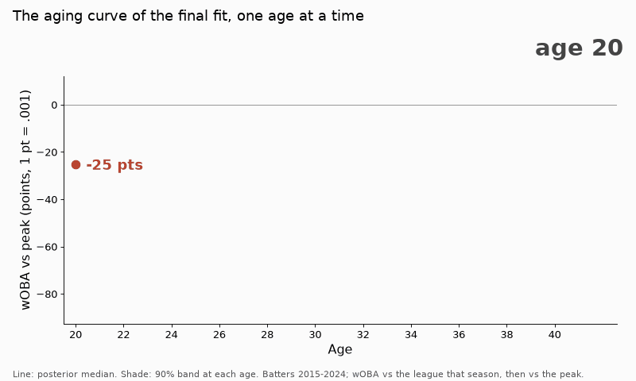

# Result: 2025 projection test

Run [36228633245](https://github.com/yasumorishima/baseball-bayes/actions/runs/36228633245),
code `03ba907` (every file byte-identical to the md5s in [PREREG.md](PREREG.md)),
data `yasumorishima/mlb-stats@7746d62`. Files: [`final-20260926T081005Z/`](final-20260926T081005Z/).

Both fits valid on the first try (no fallback): 0 divergences, 0 tree-depth
hits; max R-hat 1.0046 / 1.0071, min bulk ESS 1,274 / 1,270 (aging / no_aging).

## Readings (as pre-registered)

410 batters with PA >= 100 in 2025, 161,745 PA. Relative wOBA, PA-weighted.

| comparison | MAE difference | 95% interval | reading |
|---|---|---|---|
| **H1** aging - marcel | -0.00067 | [-0.00168, +0.00033] | indistinguishable |
| **H2** aging - no_aging | -0.00071 | [-0.00143, +0.00002] | indistinguishable |

| model | MAE | RMSE |
|---|---|---|
| aging | 0.02483 | 0.03214 |
| no_aging | 0.02554 | 0.03274 |
| marcel | 0.02550 | 0.03296 |

The point estimates favour the aging model on both metrics, but neither
interval excludes 0, so by the rule fixed beforehand neither difference is
read as a win. The expected resolution was about 0.00098 for H1 and 0.00069
for H2 (rehearsal 10); the observed differences are of that size. This says
only that one season of 410 batters cannot separate them at this size.

## Descriptive (no test)

Aging curve, relative wOBA against the peak, posterior median [90% band]:

| age | 21 | 24 | 27 | 30 | 33 | 36 | 40 |
|---|---|---|---|---|---|---|---|
| vs peak | -0.017 [-0.023, -0.012] | -0.003 [-0.005, -0.001] | -0.000 [-0.001, 0.000] | -0.006 [-0.008, -0.004] | -0.019 [-0.023, -0.016] | -0.040 [-0.046, -0.034] | -0.073 [-0.088, -0.058] |

Correction (2026-10-08): the medians at 33 and 40 were printed as -0.020 and
-0.074. `fit_aging.json` gives -0.01947 and -0.07346, so they are -0.019 and
-0.073. The bands and the peak probabilities were right.

    python aging/curve_gif.py aging/runs/final-20260926T081005Z aging/curve.gif

Peak age (maximum over 21-40): 26 with posterior probability 0.52, 27 with
0.42; the maximum over all ages falls outside 21-40 in 0.85% of draws.
