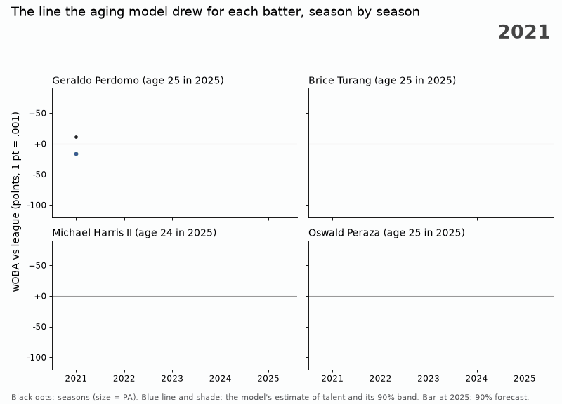

# Development tracker

Where each batter's 2025 landed against the line the aging model expected
for him: z = (actual - expected) / predictive sd, relative wOBA. Expected is
the Kalman filter of [aging.stan](../aging/aging.stan) run through his seasons
up to 2024 with the parameters of the pre-registered final fit, projected to
his 2025 age. The predictive sd counts what is still unknown about his
talent after his history, the random steps since his last season, the
season-only deviation, sampling noise for his 2025 PA, and the projection's
posterior sd.

The model's line for four batters aged 25 or younger, one season at a time.
Between seasons the line heads for what the model predicted before seeing the
next season, and jumps once that season is in. In 2025, Perdomo and Turang
landed above their 90% forecast interval and Harris II and Peraza below it.

## Calibration (2025, out of sample)

The pass rule is in the docstring of [tracker.py](tracker.py): share with
|z| > 1.645 within [0.07, 0.13] and sd of z within [0.90, 1.10]. I wrote it
before running the script, but the repository cannot show that: the rule,
the script and its output arrived in one commit.

| group | n | outside the 90% interval | sd of z | mean z |
|---|---|---|---|---|
| all | 410 | 10.2% | 0.975 | -0.02 |
| age <= 25 | 94 | 9.6% | 0.944 | 0.00 |

**Pass**, but read it for what it checks: the two-sided spread. The two tails
are not even:

| | z > 1.645 | z < -1.645 | z > 2 | z < -2 |
|---|---|---|---|---|
| observed (410) | 6.8% | 3.4% | 3.2% | 1.2% |
| N(0, 1) | 5% | 5% | 2.3% | 2.3% |

More batters beat their line than the sd allows and fewer fall below it. One
likely reason, not tested here: the 2025 set is batters with 100 PA or more,
and a batter who slumps tends to lose the playing time that would put him in
it. So treat a large positive z as less rare than N(0, 1) says, and a large
negative z as the rarer of the two. The rule is also loose: dropping the
season-only term tau from the sd would still pass (10.7%, sd 1.016).

Plug-in parameters (posterior means, curve = posterior median) are used; the
expected values differ from the Stan projection by at most 0.0009.

## Output

[out/tracker_2025.csv](out/tracker_2025.csv), one row per batter, sorted by z.
Furthest ahead of their line among age <= 25: Perdomo +2.37, Goodman +2.14,
Turang +2.06, Garcia +2.04. Furthest behind: Noel -2.17, Peraza -1.98,
Harris II -1.79.

    python aging/prepare.py <mart_batter_season @ 7746d62> prep 2024 2025
    python development/tracker.py prep aging/runs/final-20260926T081005Z development/out
    python development/gif.py prep aging/runs/final-20260926T081005Z <mart_batter_season @ 7746d62> development/out/tracker_2025.csv development/out/tracker_2025.gif
